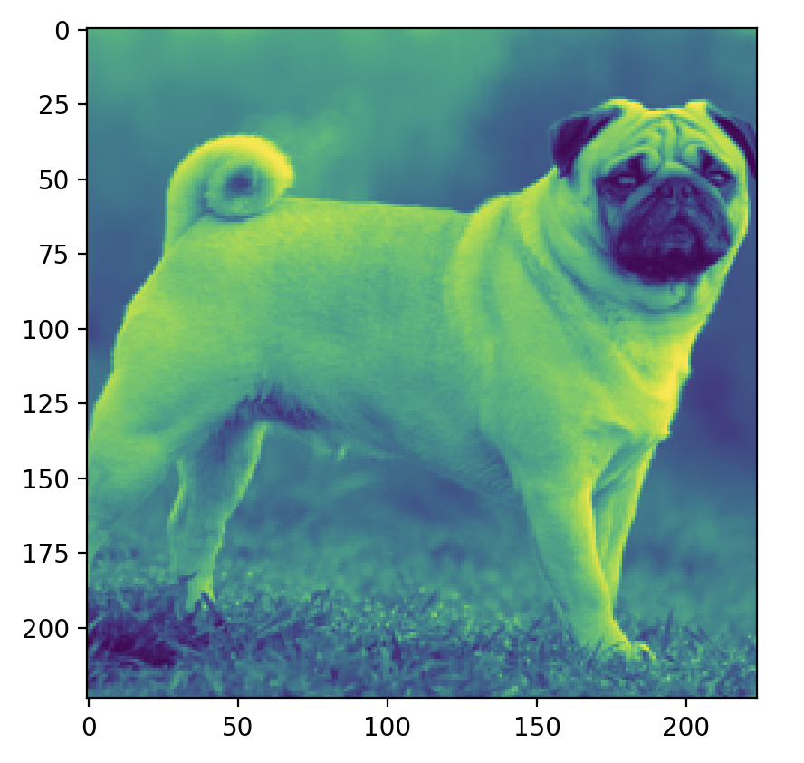

# froog  
<div align="center" >
  
  <br/>
  froog: fast real-time optimization of gradients 
  <br/>
  a beautifully compact tensor library
  <br/>
  <a href="https://github.com/kevbuh/froog">homepage</a> | <a href="https://github.com/kevbuh/froog/tree/main/docs">documentation</a> | <a href="https://pypi.org/project/froog/">pip</a>
  <br/>
  <br/>
</div>

```froog``` is an easy-to-read tensor library (<a href="https://www.pepy.tech/projects/froog">25k pip installs!</a>) with OpenCL support for GPU acceleration. Inspired by pytorch, tinygrad, and micrograd.

# Installation
```bash
pip install froog
```

More information on downloading ```froog``` in the <a href="https://github.com/kevbuh/froog/blob/main/docs/install.md">installation</a> docs. 

# Features
- <a href="https://github.com/kevbuh/froog/blob/main/froog/tensor.py">Custom Tensors</a> 
  - Backpropagation
  - Automatic Differentiation (autograd)
      - Forward and backward passes
- <a href="https://github.com/kevbuh/froog/blob/main/froog/ops.py">ML Operations</a> 
  - 2D Convolutions (im2col)
  - Numerical gradient checking
  - Acceleration methods (Adam)
  - Avg & Max pooling
- <a href="https://github.com/kevbuh/froog/blob/main/models/efficientnet.py">EfficientNet</a> inference
- <a href="https://github.com/kevbuh/froog/blob/main/froog/gpu/ops_gpu.py">GPU Support</a> 
- <a href="https://github.com/kevbuh/froog/blob/main/docs/env.md">Configuration via Environment Variables</a>
- and a bunch <a href="https://github.com/kevbuh/froog/tree/main/froog">more</a> 

# Example

Here's how you set up a simple multilayer perceptron for classification on MNIST. Looks pretty similar to pytorch, right?

```python
from froog.tensor import Tensor
from froog.nn import Linear
import froog.optim as optim

class mnistMLP:
  def __init__(self):
    self.l1 = Tensor(Linear(784, 128)) # layer 1
    self.l2 = Tensor(Linear(128, 10))  # layer 2

  def forward(self, x):
    # forward pass through both layers and softmax for output probabilities
    return x.dot(self.l1).relu().dot(self.l2).logsoftmax() 

model = mnistMLP() # create model
optim = optim.SGD([model.l1, model.l2], lr=0.001) # stochastic gradient descent optimizer
```

# Overview

The most fundamental concept in all of ```froog``` and machine learning frameworks is the <a href="https://github.com/kevbuh/froog/blob/977b09caf32f21904768b08b2772139596604603/froog/tensor.py#L47">Tensor</a>. A <a href="https://en.wikipedia.org/wiki/Tensor_(machine_learning)">tensor</a> is simply a matrix of matrices (more accurately a multi-dimensional array). 

You can create a Tensor in ```froog``` with:
```python
import numpy as np
from froog.tensor import Tensor
my_tensor = Tensor([1,2,3])
```

Notice how we had to import NumPy. If you want to create a Tensor manually, make sure that it is a NumPy array!

<!-- Learn more about ```froog``` Tensors <a href="https://github.com/kevbuh/froog/blob/main/docs/tensors.md">here</a>. -->

# Creating a model

Okay cool, so now you know that ```froog```'s main datatype is a Tensor and uses NumPy in the background. How do I actually build a model? 

Here's an example of how to create an MNIST multi-layer perceptron (MLP). We wanted to make it as simple as possible for you to do so it resembles very basic Python concepts like classes. There are really only two methods you need to define: 
1. ```__init__``` that defines layers of the model (here we use ```Linear```) 
2. ```forward``` which defines how the input should flow through your model. We use a simple dot product with a ```Linear``` layer with a <a href="https://en.wikipedia.org/wiki/Rectifier_(neural_networks)">```ReLU```</a> activation.

To create an instance of the ```mnistMLP``` model, do the same as you would in Python: ```model = mnistMLP()```. 

We support a few different optimizers, <a href="https://github.com/kevbuh/froog/blob/main/froog/optim.py">here</a> which include:
- <a href="https://en.wikipedia.org/wiki/Stochastic_gradient_descent">Stochastic Gradient Descent (SGD)</a>
- <a href="https://en.wikipedia.org/wiki/Stochastic_gradient_descent#Adam">Adaptive Moment Estimation (Adam)</a>
- <a href="https://en.wikipedia.org/wiki/Stochastic_gradient_descent#RMSProp">Root Mean Square Propagation (RMSProp)</a>

```python
from froog.tensor import Tensor
import froog.optim as optim
from froog.nn import Linear

class mnistMLP:
  def __init__(self):
    self.l1 = Tensor(Linear(784, 128))
    self.l2 = Tensor(Linear(128, 10))

  def forward(self, x):
    return x.dot(self.l1).relu().dot(self.l2).logsoftmax()

model = mnistMLP()
optim = optim.SGD([model.l1, model.l2], lr=0.001)
```

You can also create a convolutional neural net by

```python
class SimpleConvNet:
  def __init__(self):
    conv_size = 5
    channels = 17
    self.c1 = Tensor(Linear(channels,1,conv_size,conv_size))     # (num_filters, color_channels, kernel_h, kernel_w)
    self.l1 = Tensor(Linear((28-conv_size+1)**2*channels, 128))  # (28-conv+1)(28-conv+1) since kernel isn't padded
    self.l2 = Tensor(Linear(128, 10))                            # MNIST output is 10 classes

  def forward(self, x):
    x.data = x.data.reshape((-1, 1, 28, 28))                     # get however many number of imgs in batch
    x = x.conv2d(self.c1).relu()                                 # pass through conv first
    x = x.reshape(shape=(x.shape[0], -1))
    return x.dot(self.l1).relu().dot(self.l2).logsoftmax()
```

So there are two quick examples to get you up and running. You might have noticed some operations like ```reshape``` and were wondering what else you can do with ```froog```. We have many more operations that you can apply on tensors:

# Methods

## Basic Math Operations
- ```.add()``` - Addition
- ```.sub()``` - Subtraction
- ```.mul()``` - Multiplication
- ```.div()``` - Division
- ```.pow()``` - Power function
- ```.sum()``` - Sum all elements
- ```.mean()``` - Mean of all elements
- ```.sqrt()``` - Square root

## Linear Algebra Operations
- ```.dot()``` - Matrix multiplication
- ```.matmul()``` - Alias for dot

## Neural Network Operations
- ```.relu()``` - Rectified Linear Unit
- ```.sigmoid()``` - Sigmoid activation
- ```.dropout()``` - Dropout regularization
- ```.logsoftmax()``` - Log softmax function

## Tensor Manipulation
- ```.reshape()``` - Change tensor shape
- ```.pad2d()``` - Pad 2D tensors
- ```.flatten()``` - Returns a flattened 1D copy of the tensor
- ```.view()``` - Reshapes tensor (alternative to reshape)
- ```.unsqueeze()``` - Adds dimension of size 1 at specified position
- ```.squeeze()``` - Removes dimensions of size 1

## Tensor Properties
- ```.shape``` - The shape of the tensor as a tuple
- ```.size``` - Total number of elements in the tensor
- ```.ndim``` - Number of dimensions (rank) of the tensor
- ```.transpose``` - Transpose of the tensor
- ```.dtype``` - Data type of the tensor
- ```.is_gpu``` - Whether tensor is on GPU

## Device Management
- ```.to_cpu()``` - Moves tensor to CPU
- ```.to_gpu()``` - Moves tensor to GPU
- ```.gpu_()``` - In-place GPU conversion

## Tensor Utilities
- ```.detach()``` - Returns a tensor detached from computation graph
- ```.backward()``` - Performs backpropagation
- ```.to_float()``` - Converts tensor to float32 data type
- ```.to_int()``` - Converts tensor to int32 data type
- ```.to_bool()``` - Converts tensor to boolean data type

## Convolution Operations
- ```.conv2d()``` - 2D convolution
- ```.im2col2dconv()``` - Image to column for convolution

## Pooling Operations
- ```.max_pool2d()``` - 2D max pooling
- ```.avg_pool2d()``` - 2D average pooling

## Tensor Creation Methods
- ```.zeros(*shape)``` - Create tensor of zeros
- ```.ones(*shape)``` - Create tensor of ones
- ```.randn(*shape)``` - Create tensor with random normal values
- ```.eye(dim)``` - Create identity matrix
- ```.arange(start, stop, step)``` - Create tensor with evenly spaced values

# GPU Support

Froog now includes a unified device management system that automatically selects the best available GPU device. The system supports:

1. **Apple Metal** - For macOS systems with Apple Silicon or compatible GPUs
2. **OpenCL** - For systems with OpenCL-compatible GPUs
3. **CPU** - Fallback for systems without GPU support

The device management is handled transparently. To use the GPU:

```python
from froog.tensor import Tensor
from froog import get_device

# Check if GPU is available
has_gpu = get_device() is not None and get_device().name != "CPU"

# Create a tensor
x = Tensor([1, 2, 3])

# Push to GPU if available
if has_gpu:
    x = x.to_gpu()

# Operations run on GPU automatically
y = x + x
z = y * y

# Bring back to CPU when needed
result = z.to_cpu()
print(result.data)
```

You can also check what devices are available:

```python
from froog import get_available_devices
available_devices = get_available_devices()
print(f"Available devices: {available_devices}")
```

Or set a specific device:

```python
from froog import set_device
set_device("METAL")  # or "OPENCL"
```

# EfficientNet in froog!



We have an implementation of [EfficientNet v2](https://arxiv.org/abs/2104.00298) built entirely in ```froog``` using the official PyTorch weights!

Run inference with:

```bash
python3 models/efficientnet.py <https://optional_image_url>
```

I would recommend checking out the <a href="https://github.com/kevbuh/froog/blob/main/models/efficientnet.py">code</a>, it's highly documented and pretty cool.

# Tensors

Tensors are the fundamental datatype in froog, and one of the two main classes.

- ```def __init__(self, data)```:

  - Tensor takes in one param, which is the data. Since ```froog``` has a NumPy backend, the input data into tensors has to be a NumPy array.
  - Tensor has a ```self.data``` state that it holds. this contains the data inside of the tensor.
  - In addition, it has ```self.grad```. this is to hold what the gradients of the tensor is. 
  - Lastly, it has ```self._ctx```. These are the internal variables used for autograd graph construction. This is where the backward gradient computations are saved. 

*Properties*

- ```shape(self)```: this returns the tensor shape

*Methods*
- ```def zeros(*shape)```: this returns a tensor full of zeros with any shape that you pass in. Defaults to np.float32
- ```def ones(*shape)```: this returns a tensor full of ones with any shape that you pass in. Defaults to np.float32
- ```def randn(*shape):```: this returns a randomly initialized Tensor of *shape

*Gradient calculations*

- ```froog``` computes gradients automatically through a process called automatic differentiation. it has a variable ```_ctx```, which stores the chain of operations. It will take the current operation, let's say a dot product, and go to the dot product definition in ```froog/ops.py```, which contains a backward pass specifically for dot products. all methods, from add to 2x2 maxpools, have this backward pass implemented.

*Functions*

The other base class in froog is the class ```Function```. It keeps track of input tensors and tensors that need to be saved for backward passes

- ```def __init__(self, *tensors)```: takes in an argument of tensors, which are then saved. 
- ```def save_for_backward(self, *x)```: saves Tensors that are necessary to compute for the computation of gradients in the backward pass. 
- ```def apply(self, arg, *x)```: takes care of the forward pass, applying the operation to the inputs.

*Register*

- ```def register(name, fxn)```: allows you to add a method to a Tensor. This allows you to chain any operations, e.g. x.dot(w).relu(), where w is a tensor

# Contributing
<!-- THERES LOT OF STUFF TO WORK ON! VISIT THE <a href="https://github.com/kevbuh/froog/blob/main/docs/bounties.md">BOUNTY SHOP</a>  -->

Pull requests will be merged if they:
* increase simplicity
* increase functionality
* increase efficiency

More info on <a href="https://github.com/kevbuh/froog/blob/main/docs/contributing.md">contributing</a>. Make sure to run ```python -m pytest``` before creating a PR.

<!-- # Documentation
Need more information about how ```froog``` works? Visit the <a href="https://github.com/kevbuh/froog/tree/main/docs">documentation</a>. -->